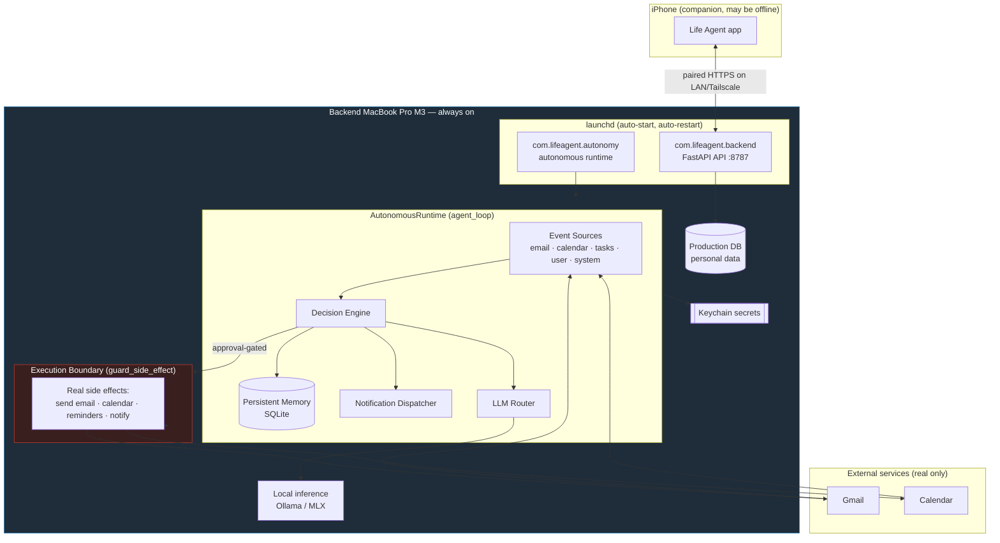

# Autonomous Architecture & Service Map

> Section 35 — how the Life Agent runs **autonomously on the Backend Mac**, fully independent of the
> Development Mac, while the same code runs as a safe **simulation** on the Dev Mac.

This document is the production architecture reference for the autonomous runtime introduced in
`backend/app/autonomy/`. It complements [ARCHITECTURE.md](ARCHITECTURE.md) (system overview),
[THREAT_MODEL.md](THREAT_MODEL.md) (content trust + approval), and
[PRODUCTION_BACKEND_SETUP.md](PRODUCTION_BACKEND_SETUP.md) (deployment).

---

## 1. Two-Mac separation

| | Development MacBook | Backend MacBook Pro (M3) |
|---|---|---|
| `LIFE_AGENT_ENV` | `development` / `testing` | `production` |
| `LIFE_AGENT_EXECUTION_MODE` | `simulation` (forced) | `production` |
| Event sources | mocked / replayed | real Gmail, Calendar, tasks |
| LLM | stubbed / cached profiles | local inference (Ollama/MLX) |
| Memory | ephemeral, resettable | persistent SQLite (real user data) |
| Real side effects | **structurally impossible** | permitted, approval-gated |
| Autonomous loop | manual `tick` only (for tests) | continuous launchd service |

The **execution boundary** ([`app/autonomy/execution.py`](../backend/app/autonomy/execution.py)) is
the single chokepoint. A real-world side effect requires **all** of:

1. `execution_mode == production` (Backend Mac only),
2. `mode == controlled_action`,
3. the specific feature flag for that effect enabled.

Config guardrails make illegal states unrepresentable: `env=development` can never set
`execution_mode=production`, and `execution_mode=production` requires a `production`/`staging`
environment.

---

## 2. Production architecture (Backend Mac)



The Development Mac is **absent** from this diagram by design: nothing in the production path
depends on it. It is used only to build releases and to run the identical code in simulation.

---

## 3. Service map — the six autonomous services

All six run as supervised components of one launchd-managed process
([`com.lifeagent.autonomy`](../infrastructure/launchd/com.lifeagent.autonomy.plist)), coordinated by
`agent_loop`. Health for every component is exposed at `GET /api/v1/autonomy/status`.

| Service | Source | Responsibility | Sim behavior | Prod behavior |
|---|---|---|---|---|
| `agent_loop` | [`runtime.py`](../backend/app/autonomy/runtime.py) | Continuous tick loop; supervises the rest | manual `tick()` | 30s loop, graceful SIGTERM |
| `email_monitor` | [`sources.py`](../backend/app/autonomy/sources.py) | Poll inbound email → events | replays seeded rows | real Gmail (Phase 2) |
| `llm_router` | [`router.py`](../backend/app/autonomy/router.py) | Map task → model profile | `development-*` profiles | `production-*` local models |
| `memory_manager` | [`memory.py`](../backend/app/autonomy/memory.py) | Long-term memory | ephemeral, resettable | persistent SQLite |
| `decision_engine` | [`decision.py`](../backend/app/autonomy/decision.py) | Event → proposed action | identical logic | identical logic |
| `notification_dispatcher` | [`notifications.py`](../backend/app/autonomy/notifications.py) | Proactive user nudges | records simulated | real notifications (flagged) |

### Auto-start / restart / graceful shutdown

`com.lifeagent.autonomy.plist` provides:

- `RunAtLoad` — starts on boot/login of the Backend Mac.
- `KeepAlive` (Crashed) + `ThrottleInterval=30` — restarts on failure without tight crash loops.
- `ExitTimeOut=20` + a `SIGTERM`/`SIGINT` handler in
  [`service.py`](../backend/app/autonomy/service.py) — the current tick finishes, then the loop
  stops cleanly.
- `StandardOutPath` / `StandardErrorPath` — structured logs under `~/LifeAgent/logs/`.

---

## 4. Event → decision flow

```mermaid
sequenceDiagram
    participant S as Event Source
    participant L as agent_loop
    participant D as Decision Engine
    participant CT as Content Trust
    participant M as Memory
    participant N as Notifier
    participant B as Execution Boundary

    L->>S: poll(limit)
    S-->>L: [Event] (email body = untrusted)
    L->>D: decide(event)
    D->>CT: scan_untrusted(payload)
    alt injection detected
        CT-->>D: suspicious
        D->>M: remember(security note)
        D-->>L: flagged_untrusted (treated as data)
    else clean
        D->>D: classify + approval policy
        D->>N: dispatch(notification)
        D->>M: remember(context)
        Note over D,B: real reply/send NEVER auto-executed;<br/>requires approval + production boundary
        D-->>L: proposed_action + requires_approval
    end
```

Untrusted external content (email bodies, documents) is **never** treated as instructions. Even if
approval were bypassed by a bug, `guard_side_effect` blocks the effect on any non-production host.

---

## 5. Operating the autonomy service

```bash
# On the Backend Mac
launchctl list | grep com.lifeagent.autonomy      # is it loaded?
launchctl kickstart -k gui/$(id -u)/com.lifeagent.autonomy   # restart
launchctl stop com.lifeagent.autonomy             # graceful stop (SIGTERM)

# CLI (from the deployed backend dir, venv active)
python -m app.autonomy.service list        # the six services
python -m app.autonomy.service preflight    # verify execution boundary
python -m app.autonomy.service status       # health snapshot (JSON)
python -m app.autonomy.service run          # run the loop (launchd does this)

# Health via API
curl -H "Authorization: Bearer <token>" http://127.0.0.1:8787/api/v1/autonomy/status

# Full verification (Section 35.10)
./scripts/verify_autonomy.sh
```

On the Development Mac, exercise proactive behavior safely with a single tick:

```bash
curl -X POST -H "Authorization: Bearer <dev-token>" \
  http://127.0.0.1:8787/api/v1/autonomy/tick        # 409 on a production backend
```

---

## 6. Independence checklist (Section 35.10)

`scripts/verify_autonomy.sh` asserts the Backend Mac is self-sufficient:

- [x] Autonomy launchd service loaded and running.
- [x] Execution boundary reports `production` (real, approval-gated effects).
- [x] LLM router resolves **local** `production-*` profiles.
- [x] Persistent memory survives a process restart.
- [x] Continuous loop is ticking (proactive triggers execute).
- [x] No simulation-only components active in production.
- [x] iPhone can be offline; API + autonomy keep running.
- [x] Survives reboot (`RunAtLoad`).
